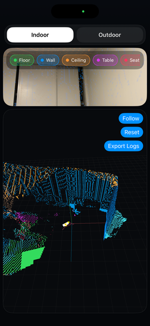
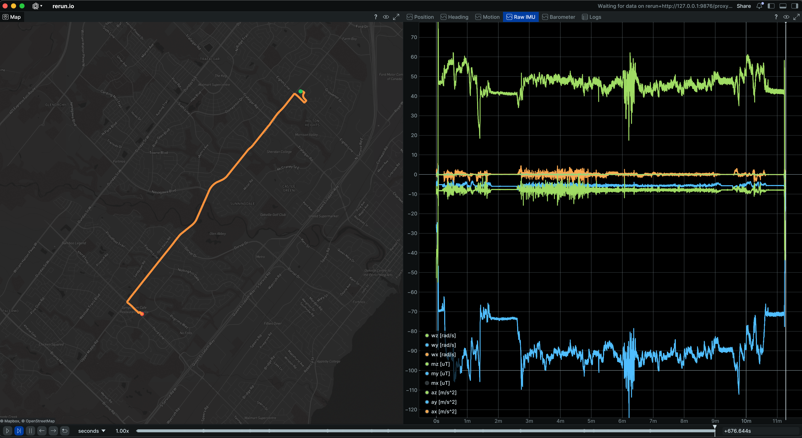
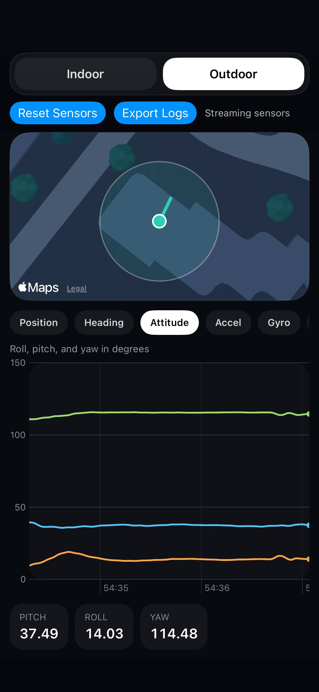

# iOS Motion Logger

[](https://github.com/yongkyuns/ios-motion-logger/actions/workflows/ci.yml)
[](LICENSE)
[](#requirements)
[](#requirements)

📱 A simple iPhone app for logging motion, location, and AR sensor data, then exporting it for analysis.

This repo gives you two demos:

- 🏠 `Indoor`: ARKit-based tracking with a live semantic camera view, a followable 3D map, saved map points, and semantic mesh export on devices that support scene reconstruction
  <p align="center">
    
    
  </p>
- 🌤️ `Outdoor`: Core Location + Core Motion logging with a live map plus switchable charts for GPS, heading, attitude, accelerometer, gyroscope, magnetometer, and barometer
  <p align="center">
    
    
  </p>

It also includes:

- 📦 one-tap export of session logs as a single JSON package
- 🗺️ Python tools to visualize exported logs in Rerun

## ✨ What You Can Do

- Record live sensor data on an iPhone
- Export sessions for offline debugging and analysis
- Visualize Indoor AR logs and Outdoor GPS/IMU logs in Rerun
- Inspect logs without keeping any personal Apple team IDs or tokens in the repo

## ✅ Requirements

- Xcode 16+
- iOS 17+
- A physical iPhone for sensor and AR features
- `xcodegen` if you want to regenerate the Xcode project from `project.yml`
- Python 3.10+ for the visualization scripts

## 🚀 Quick Start

### 1. Clone the repo

```bash
git clone git@github.com:yongkyuns/ios-motion-logger.git
cd ios-motion-logger
```

### 2. Open the app in Xcode

You can use the checked-in project directly:

```bash
open IOSMotionLogger.xcodeproj
```

If you want to regenerate it first:

```bash
xcodegen generate
open IOSMotionLogger.xcodeproj
```

### 3. Set up signing

In Xcode:

1. Select the `IOSMotionLogger` target
2. Open `Signing & Capabilities`
3. Choose your Apple development team
4. Build and run on your iPhone

This public repo intentionally does not include a personal team ID or personal bundle identifier.

## 🧭 Using the App

### Indoor

Use `Indoor` when you want:

- ARKit trajectory tracking
- saved map points
- semantic mapping / mesh visualization on devices that support scene reconstruction
- indoor AR logging workflows

Typical flow:

1. Open `Indoor`
2. Move the phone slowly through the scene
3. Tap `Export Logs`
4. Open the exported `world-*.json` file in the Indoor Rerun viewer

### Outdoor

Use `Outdoor` when you want:

- GPS position and accuracy
- heading / compass
- device attitude
- raw IMU streams
- barometer / relative altitude
- a live route map and switchable streaming charts

If the barometer says it needs permission, enable:

`Settings > Privacy & Security > Motion & Fitness`

Then make sure:

- `Fitness Tracking` is on
- this app is allowed to access Motion & Fitness

Typical flow:

1. Open `Outdoor`
2. Grant location and Motion & Fitness access if prompted
3. Walk or move with the phone while switching between map and signal views
4. Tap `Export Logs`
5. Open the exported `geo-*.json` file in the Outdoor Rerun viewer

## 📂 Export Format

`Indoor` exports a single JSON package that contains embedded files such as:

- `world_pose.csv`
- `world_map_points.csv`
- `world_semantic_mesh.jsonl`
- `world_events.jsonl`

`world_semantic_mesh.jsonl` is written as a final export-time snapshot rather than a continuous mesh stream, which keeps Indoor exports much smaller.

`Outdoor` exports a single JSON package that contains embedded CSV and JSONL files such as:

- `location.csv`
- `heading.csv`
- `device_motion.csv`
- `accelerometer.csv`
- `gyro.csv`
- `magnetometer.csv`
- `barometer.csv`
- `status.jsonl`
- `events.jsonl`

The app first writes raw files to:

```text
Documents/ARLogs/<session>/
```

Then it packages them into one shareable `.json` export.

## 📊 Visualize Logs Step by Step

Install the Python dependency first:

```bash
python3 -m pip install rerun-sdk
```

### Indoor in Rerun

Run the Indoor viewer:

```bash
python3 scripts/indoor.py /path/to/world-YYYY-MM-DDTHH-MM-SS.sssZ.json --spawn
```

Useful notes:

- The viewer shows device trajectory, saved map points, semantic mesh, and event logs
- `world_semantic_mesh.jsonl` is written as a final export-time snapshot to keep exports smaller
- This viewer does not use Mapbox
- You can save a headless recording instead of spawning the UI:

```bash
python3 scripts/indoor.py /path/to/world-YYYY-MM-DDTHH-MM-SS.sssZ.json --save /tmp/world.rrd
```

### Outdoor in Rerun

Run the Outdoor viewer:

```bash
python3 scripts/outdoor.py /path/to/geo-YYYY-MM-DDTHH-MM-SS.sssZ.json --spawn
```

Useful notes:

- The viewer includes map, position, heading, motion, raw IMU, barometer, and logs
- If barometer samples are present, the `Barometer` tab opens by default
- The embedded map works without a token and falls back to OpenStreetMap
- If `MAPBOX_ACCESS_TOKEN` is set before launch, the embedded map switches to the dark Mapbox basemap
- You can save a headless recording instead of spawning the UI:

```bash
python3 scripts/outdoor.py /path/to/geo-YYYY-MM-DDTHH-MM-SS.sssZ.json --save /tmp/geo.rrd
```

## 🔐 Environment Variables

No personal tokens are stored in this repo.

`MAPBOX_ACCESS_TOKEN` is optional for the Outdoor Rerun viewer.

If you want Mapbox-backed maps, use:

```bash
export MAPBOX_ACCESS_TOKEN=your_mapbox_token
```

If your shell does not source your profile when launching the script, pass the token in the command invocation:

```bash
MAPBOX_ACCESS_TOKEN=your_mapbox_token python3 scripts/outdoor.py /path/to/geo-...json --spawn
```

The Outdoor Rerun script uses `MAPBOX_ACCESS_TOKEN` as the only token source and forwards it to the Rerun viewer when needed.

See [.env.example](.env.example) for the expected variable name.

## 🧼 Privacy Notes

This public repo intentionally excludes:

- personal Apple signing team identifiers
- personal bundle identifiers
- private access tokens
- local export artifacts
- editor and device-specific metadata

## 📄 License

MIT. See [LICENSE](LICENSE).
